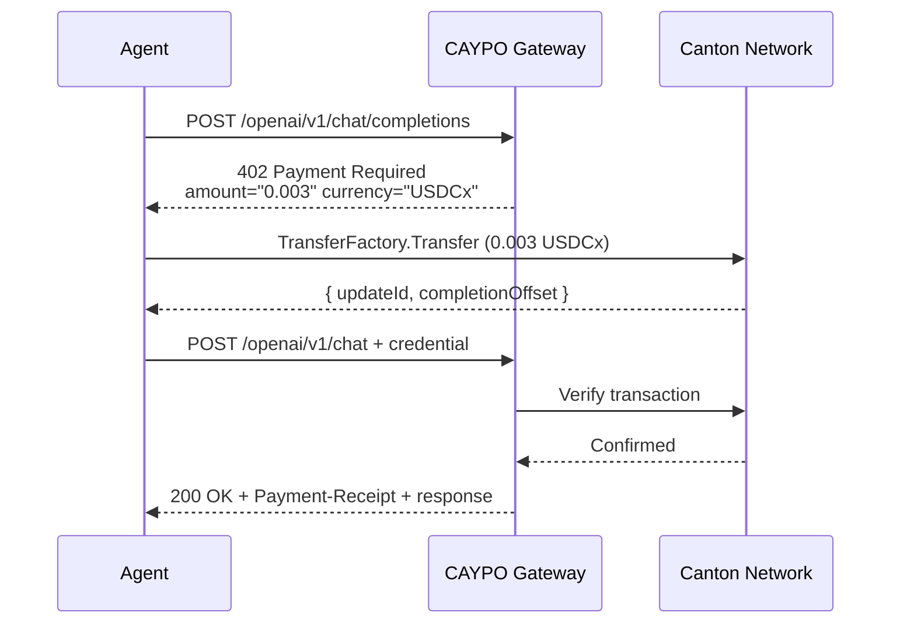

<p align="center">
  
</p>

<p align="center">
  <a href="https://www.npmjs.com/org/caypo"></a>
  <a href="LICENSE-APACHE"></a>
  
  
  <a href="https://github.com/anilkaracay/Caypo"></a>
</p>

<p align="center">
  <a href="https://caypo.xyz">caypo.xyz</a> · <a href="https://mpp.caypo.xyz">mpp.caypo.xyz</a> · <a href="https://www.npmjs.com/org/caypo">npm</a> · <a href="https://caypo.xyz/docs">Docs</a> · <a href="https://github.com/anilkaracay/Caypo">GitHub</a>
</p>

---

## What is CAYPO?

AI agents need to pay for things — API calls, compute, data, services. But agents can't hold money, authorize payments, or settle transactions on their own.

**CAYPO gives AI agents their own bank account on Canton Network.** Five accounts — checking, savings, credit, exchange, investment — all powered by USDCx stablecoins and the [Machine Payments Protocol (MPP)](https://mpp.dev) by Stripe and Tempo. No credit cards, no API keys, no humans in the loop.

Canton Network is the institutional blockchain built by Digital Asset, backed by DTCC, Goldman Sachs, JPMorgan, and BNP Paribas. CAYPO is the bridge between Canton and the agentic economy.

## Why Canton?

- **Privacy by default** — Only sender and receiver see payment details. No public ledger exposure.
- **Institutional compliance** — DTCC, Goldman Sachs, JPMorgan, BNP Paribas already on Canton. Basel III compliant.
- **USDCx by Circle** — Institutional-grade stablecoin, 1:1 USDC-backed via xReserve, cross-chain via CCTP.
- **Atomic settlement** — Pay and settle in one transaction. No pending states, no chargebacks.
- **Canton Coin rewards** — Applications earn CC mining rewards based on usage (Cantonomics).

## Quick Start

```bash
# Install the CLI
npm install -g @caypo/canton-cli

# Set up your agent wallet
caypo init

# Check balance
caypo balance

# Send USDCx
caypo send 10.00 to Bob::1220abcdef...

# Pay for an API call (auto-handles 402 flow)
caypo pay https://mpp.caypo.xyz/openai/v1/chat/completions --max-price 0.05

# Install MCP server for Claude Desktop
caypo mcp install
```

## How It Works



## Packages

| Package | Install | Description |
|---------|---------|-------------|
| **[@caypo/canton-sdk](packages/sdk/)** | `npm i @caypo/canton-sdk` | Core SDK — Canton API client, USDCx, wallets, safeguards, MPP auto-pay |
| **[@caypo/mpp-canton](packages/mpp/)** | `npm i @caypo/mpp-canton` | Canton payment method for MPP — accept and make USDCx payments |
| **[@caypo/canton-cli](packages/cli/)** | `npm i -g @caypo/canton-cli` | CLI — 36 commands: init, balance, send, pay, savings, credit, exchange, invest |
| **[@caypo/canton-mcp](packages/mcp/)** | `npx @caypo/canton-mcp` | MCP server — 35 tools + 20 prompts for Claude, Cursor, Windsurf |
| **[@caypo/canton-gateway](packages/gateway/)** | `npm i @caypo/canton-gateway` | API gateway — 17 services, 46 endpoints, pay-per-request |

## Code Examples

**Accept payments (server side):**

```typescript
import { cantonServer } from "@caypo/mpp-canton/server";

const server = cantonServer({
  ledgerUrl: "http://localhost:7575",
  token: process.env.CANTON_JWT,
  userId: "ledger-api-user",
  recipientPartyId: "Gateway::1220...",
  network: "mainnet",
});

const receipt = await server.verify({ credential });
// { method: "canton", reference: updateId, status: "success" }
```

**Make payments (agent side):**

```typescript
import { CantonAgent } from "@caypo/canton-sdk";

const agent = await CantonAgent.create();
const { available } = await agent.checking.balance();

const result = await agent.mpp.pay("https://mpp.caypo.xyz/openai/v1/chat/completions", {
  method: "POST",
  body: JSON.stringify({ model: "gpt-4o", messages: [{ role: "user", content: "Hello" }] }),
  maxPrice: "0.05",
});
// result.response.status → 200
// result.receipt → { updateId, amount: "0.003", ... }
```

## MCP Integration

```bash
caypo mcp install
```

Then ask Claude: *"What's my CAYPO balance?"* or *"Send 5 USDCx to Alice::1220..."*

**35 tools** — balance, send, pay, savings, credit, exchange, invest, safeguards, traffic, and more.
**20 prompts** — morning briefing, financial report, security audit, spending analysis.

<details>
<summary><strong>Gateway Services</strong> — 17 services, 46 endpoints</summary>

Pay-per-request access. No API keys needed — just USDCx.

| Service | Endpoints | Price |
|---------|-----------|-------|
| **OpenAI** | chat, embeddings, images, audio | $0.001 – $0.05 |
| **Anthropic** | messages | $0.01 |
| **fal.ai** | image gen, audio, video | $0.01 – $0.10 |
| **Firecrawl** | scrape, crawl, map, extract | $0.005 – $0.02 |
| **Google Gemini** | chat, reasoning, embeddings | $0.005 – $0.02 |
| **Groq** | chat, embeddings | $0.001 – $0.005 |
| **Perplexity** | chat with search | $0.01 |
| **Brave Search** | web, images, news, videos | $0.001 – $0.005 |
| **DeepSeek** | chat | $0.005 |
| **Resend** | send email, batch | $0.005 |
| **Together AI** | chat, embeddings, images | $0.001 – $0.02 |
| **ElevenLabs** | TTS, voice clone | $0.02 – $0.05 |
| **OpenWeather** | current, forecast | $0.001 |
| **Google Maps** | geocode, places, directions | $0.005 |
| **Judge0** | execute code, languages | $0.002 |
| **Reloadly** | gift cards | $0.01+ |
| **Lob** | postcards, letters, address verify | $0.01 – $0.50 |

</details>

## Architecture

```
┌─────────────┐  ┌─────────────┐  ┌─────────────┐
│  MCP Server │  │     CLI     │  │   Gateway   │
│  35 tools   │  │  36 commands│  │ 17 services │
│  20 prompts │  │             │  │  46 endpts  │
└──────┬──────┘  └──────┬──────┘  └──────┬──────┘
       └────────────────┼────────────────┘
               ┌────────▼────────┐
               │ @caypo/canton-sdk│
               │                 │
               │ CantonAgent     │
               │ 5 Accounts      │
               │ Keystore (AES)  │
               │ SafeguardMgr    │
               └────────┬────────┘
                        │
               ┌────────▼────────┐
               │ @caypo/mpp-canton│
               │                 │
               │ cantonMethod    │
               │ cantonClient    │
               │ cantonServer    │
               └────────┬────────┘
                        │
               ┌────────▼────────┐
               │  Canton Network │
               │  USDCx (CIP-56) │
               │  CC · Privacy   │
               └─────────────────┘
```

## Verified on Canton DevNet

```
312 tests — 100% passing
 14 E2E tests against live Canton DevNet (Splice v0.5.12)
 35 MCP tools — all live
 20 MCP prompts — all implemented
 46 gateway endpoints — /health returns 200
```

Run `pnpm verify` to reproduce all checks locally.

## Roadmap

| Version | Features | Status |
|---------|----------|--------|
| **v0.1** | MPP payment method, Core SDK, CLI (8 cmds), MCP server (14 tools), Gateway | Done |
| **v0.2** | Savings, Credit, Exchange, Investment, 35 MCP tools, 36 CLI commands, Agent Skills, Gateway live, Landing page | Done |
| **v1.0** | Production hardening, full Canton mainnet support | Next |
| **v1.1** | Session intent (streaming payments, pay-per-token) | Planned |
| **v2.0** | Real DeFi protocol adapters, Temple DEX integration | Planned |

## Development

```bash
pnpm install        # Install dependencies
pnpm build          # Build all packages
pnpm test           # Run 312 tests
pnpm test:e2e       # E2E tests (needs Canton sandbox)
pnpm verify         # Full verification suite
```

## Contributing

We welcome contributions. Please [open an issue](https://github.com/anilkaracay/Caypo/issues) or submit a PR. See [ARCHITECTURE.md](ARCHITECTURE.md) for code structure overview.

## Built by Cayvox Labs

Canton Network mainnet validator operator since 2026. Canton Catalyst 2026 alumni. Running a production mainnet validator (TIFA-validator-1) on Canton Global Synchronizer.

Building financial products on Canton: **CAYPO** (agent payments), **TIFA Finance** (validator infrastructure), **Dualis Finance** (institutional lending).

## License

Dual-licensed under [Apache 2.0](LICENSE-APACHE) and [MIT](LICENSE-MIT). Copyright 2026 Cayvox Labs.

---

<p align="center">
  <a href="https://caypo.xyz">caypo.xyz</a> · <a href="https://mpp.caypo.xyz">mpp.caypo.xyz</a> · <a href="https://canton.network">Canton Network</a> · <a href="https://mpp.dev">MPP Protocol</a>
</p>
